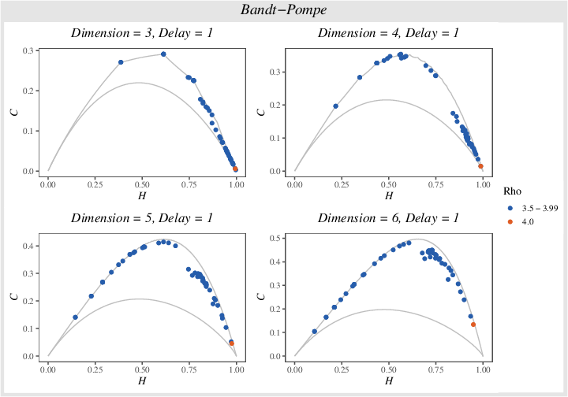
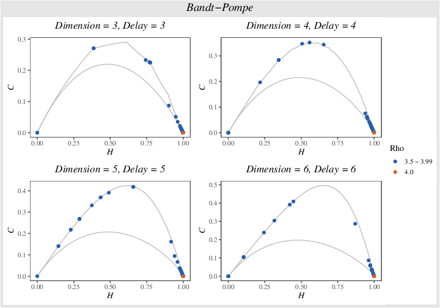
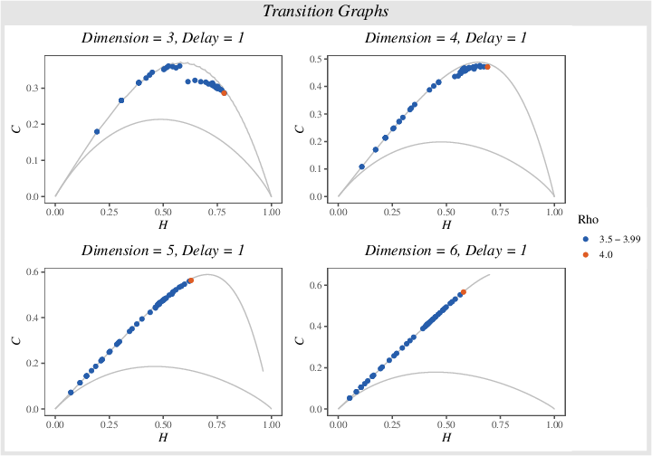
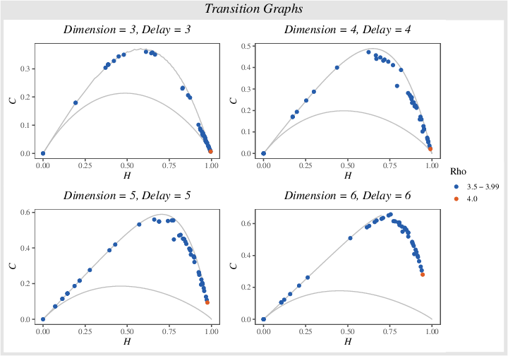
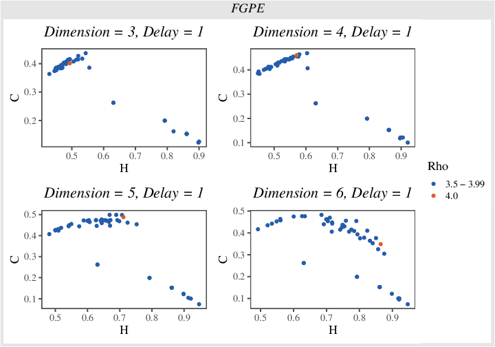
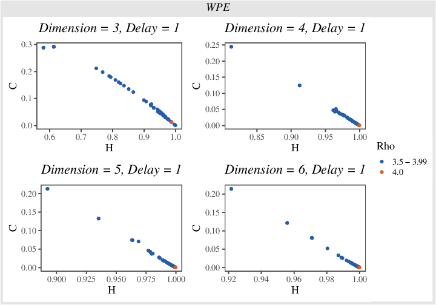

# Logistic maps analysis using Bandt-Pompe symbolization

#### Bandt-Pompe with delay = 1

#### Bandt-Pompe with delay = dimension

#### Transition Graphs with delay = 1

#### Transition Graphs with delay = dimension

#### FGPE with delay = 1

#### WPE with delay = 1

